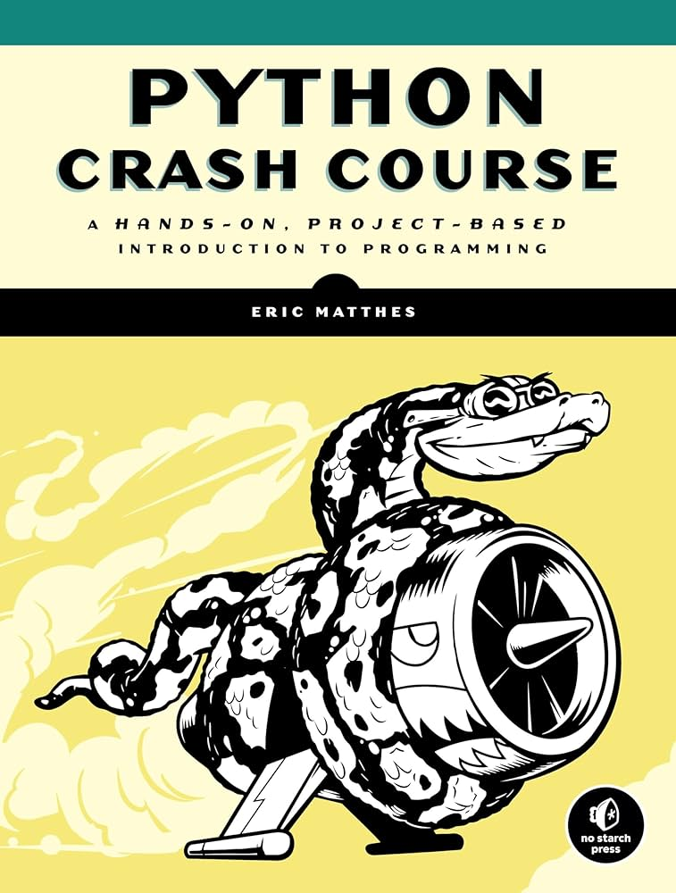
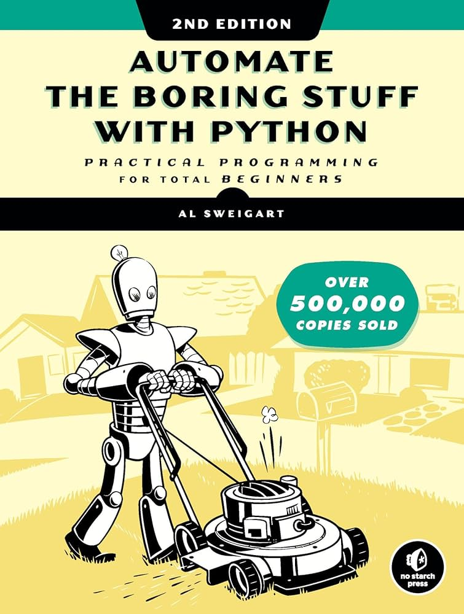
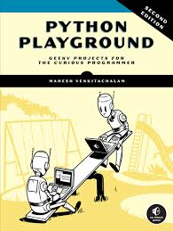
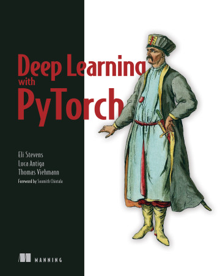
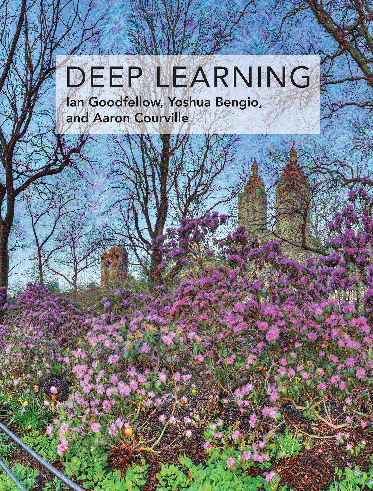
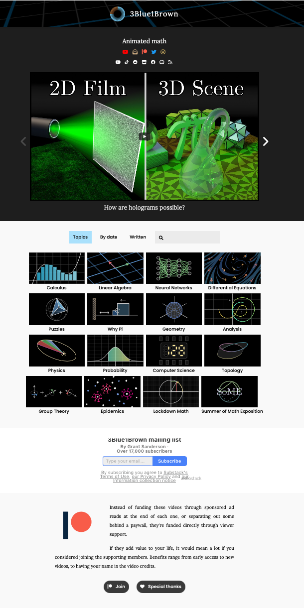

# ML-DL-Self-Learning-Road-Map

by ***Lilong Dong, ph.D.*** on 2024-10-24 

This repository contains the info on self-learning linux, python, machine learning, deep learning and more.

# Some Basics of Python

I highly recommand these three books for the beginners who never ever touch anything about python or even coding. these books guide newbies to the basics of the python in a format of hand-on practicals of building up several projects. I highly recommand the learners to follow the examplary code in the book and type them instead of simply copy and paste. Another advice is to firstly read the **Python Crash Course** by **Eric Matthes**, it is the best structured and give a quite comprehensive introduction of python language, and then try to follow the guidelines of projects.

1. **Python Crash Course** by **Eric Matthes**   
There is an available and free [online book](http://ehmatthes.github.io/pcc/cheatsheets/README.html)   
the paperback book from [Amazon]()   
you may as well find some the Chinese version of this book in [jd.com}()   

  
  

2. **Automate the Boring Stuff with Python: Practical Programming for Total Beginners** by **Al Sweigart**   
There is also a free [online book](https://automatetheboringstuff.com/#toc) available.   
the Amazon link is [here](https://www.amazon.com/Automate-Boring-Stuff-Python-2nd/dp/1593279922)   
[JD.com]() sells the book in the same package with the **python crash course**.

  

3. **Python Playground, 2nd Edition** by **Mahesh Venkitachalam**
Unfortunately, there is no free online book available, you may as well download the newest version from some certain source.   
The Aamzon link is [here](https://www.amazon.sg/Python-Playground-2nd-Projects-Programmer/dp/1718503040/ref=pd_sbs_d_sccl_2_1/358-3832204-2242245?pd_rd_w=nHCFP&content-id=amzn1.sym.7129a2ab-7686-493d-a6b5-1260dd6cbab5&pf_rd_p=7129a2ab-7686-493d-a6b5-1260dd6cbab5&pf_rd_r=D8QPRTAV17MXJWQYH356&pd_rd_wg=NiVqm&pd_rd_r=640f4381-f155-49e4-9320-c5359b5572c8&pd_rd_i=1718503040&psc=1)   

  

# Machine Learning

Once you have finished learning the **Python Crash Course** and get a little bit practical python coding basics, you can jump directly into the machine learning. the book I recommanded here is **Hands-On Machine Learning with Scikit-Learn, Keras, and TensorFlow (3rd ed.)** by **Aurélien Géron**, but please only direct your learning radar within the scope of scikit-learn and tensorflow, especially the former one, which is a classic python library of machine learning algorithms.

  

please find yourself available access to this book, the available link to the newest version is not available anymore.

another best way to learn the machine learning is to read and go through the tutorials or documentation of the machine learning framework such as Scikit-Learn or Keras.

I would not suggest TensorFlow, which was and has been maintained by Google, the tensorflow code migration from 2.0 to 3.0 is a pain in the ass, and the complexity of tensorflow is bit overwhelming to beginners. 

# Deep Learning

There are several classic textbooks around the deep learning, I would suggest a few authored by Oversea researchers and a handful of others by Chinese authors.

There are two mainstream deep learning framework, a.k.a TensorFlow by Google, and Pytorch by Meta (former facebook). The latter is light weight and much more userfriendly. The Pytorch is very popular in academia mainfly for its ease-to-use and costumerization-flexible, while TensorFlow finds its popularity in industry for its scalibity. My suggestion is to put focus on Pytorch first.

1. **Deep Learning with PyTorch** by **Eli Stevens, Luca Antiga, and Thomas Viehmann** is a nice guideline that introduce how to do neural network by using Pytorch deep learning framework.

  

2. **Deep Learning** by **Ian Goodfellow**, **Yoshua Bengio**, **Aaron Courville**. The masterpiece of classic, the must-to-read of this particular area of machine learning. This book brings you into the theorectical part of deep learning and unveils the mathmatics behind the scene.

  

There are so many reading notes in chinese for this masterpiece, you may as well find them in either github or other available online sources.   
As for some other helpful learning resources on the theory of deep learning or machine learning, I would suggest the project called **[3Brow1Blue](https://www.3blue1brown.com)**, from which you can pick up the algebra and statistics for understanding the deep learning.   

  

